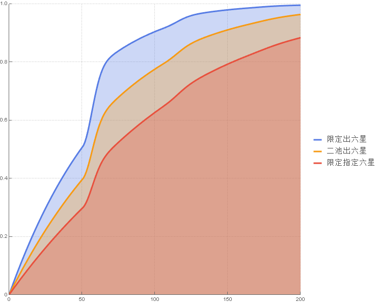
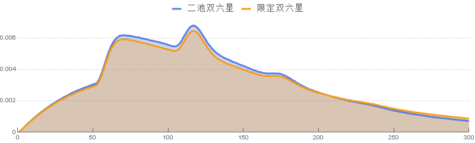
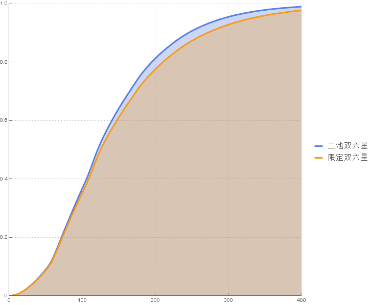
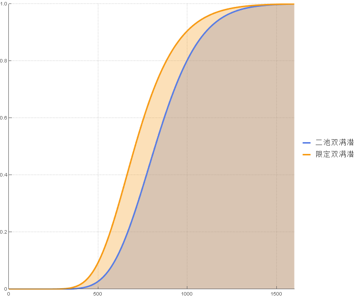
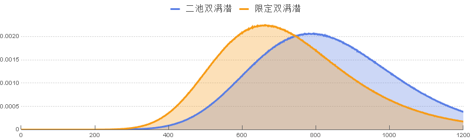

| 事件         |   期望 | 中位数 | 标准差 | 欧皇 | 欧洲人 | 非洲人 | 非酋 | 被遗忘者 |
| :----------- | -----: | -----: | -----: | ---: | -----: | -----: | ---: | -------: |
| 二池出六星   |  69.19 |     57 |  57.18 |    6 |     29 |     92 |  142 |      271 |
| 二池双六星   | 138.37 |    122 |  80.85 |   36 |     80 |    179 |  245 |      398 |
| 二池双满潜   | 830.24 |    813 | 198.08 |  536 |    690 |    952 | 1092 |     1366 |
| 限定出六星   |  49.42 |     50 |  36.86 |    4 |     21 |     62 |   98 |      174 |
| 限定指定六星 |  98.85 |     70 |  87.19 |    8 |     41 |    132 |  212 |      410 |
| 限定双六星   | 148.26 |    126 |  94.66 |   37 |     82 |    190 |  271 |      470 |
| 限定双满潜   | 726.83 |    702 | 194.93 |  456 |    589 |    837 |  984 |     1299 |

- 欧皇: 超越了 95% 的玩家
- 欧洲人: 超越了 75% 的玩家
- 非洲人: 超越了 25% 的玩家
- 非酋: 超越了 10% 的玩家
- 被诅咒者: 超越了 1% 的玩家

---

|  次数 | 二池出六星 | 二池双六星 | 二池双满潜 | 限定出六星 | 限定指定六星 | 限定双六星 | 限定双满潜 |
| ----: | ---------: | ---------: | ---------: | ---------: | -----------: | ---------: | ---------: |
|     1 |     0.998% |     0.000% |     0.000% |     1.399% |       0.699% |     0.000% |     0.000% |
|     2 |     1.988% |     0.010% |     0.000% |     2.781% |       1.395% |     0.010% |     0.000% |
|     3 |     2.968% |     0.030% |     0.000% |     4.141% |       2.086% |     0.029% |     0.000% |
|     4 |     3.939% |     0.059% |     0.000% |     5.482% |       2.770% |     0.058% |     0.000% |
|     5 |     4.901% |     0.098% |     0.000% |     6.807% |       3.451% |     0.096% |     0.000% |
|     6 |     5.852% |     0.146% |     0.000% |     8.114% |       4.127% |     0.143% |     0.000% |
|     7 |     6.795% |     0.204% |     0.000% |     9.401% |       4.798% |     0.199% |     0.000% |
|     8 |     7.725% |     0.269% |     0.000% |    10.667% |       5.465% |     0.263% |     0.000% |
|     9 |     8.647% |     0.344% |     0.000% |    11.917% |       6.127% |     0.336% |     0.000% |
|    10 |     9.560% |     0.426% |     0.000% |    13.149% |       6.783% |     0.417% |     0.000% |
|    11 |    10.465% |     0.517% |     0.000% |    14.364% |       7.434% |     0.507% |     0.000% |
|    12 |    11.362% |     0.617% |     0.000% |    15.563% |       8.081% |     0.603% |     0.000% |
|    13 |    12.248% |     0.724% |     0.000% |    16.746% |       8.724% |     0.708% |     0.000% |
|    14 |    13.125% |     0.839% |     0.000% |    17.911% |       9.364% |     0.821% |     0.000% |
|    15 |    13.993% |     0.962% |     0.000% |    19.061% |       9.998% |     0.941% |     0.000% |
|    16 |    14.853% |     1.093% |     0.000% |    20.194% |      10.628% |     1.068% |     0.000% |
|    17 |    15.705% |     1.231% |     0.000% |    21.311% |      11.255% |     1.202% |     0.000% |
|    18 |    16.547% |     1.375% |     0.000% |    22.413% |      11.876% |     1.342% |     0.000% |
|    19 |    17.383% |     1.528% |     0.000% |    23.501% |      12.494% |     1.489% |     0.000% |
|    20 |    18.209% |     1.686% |     0.000% |    24.570% |      13.106% |     1.643% |     0.000% |
|    21 |    19.029% |     1.851% |     0.000% |    25.627% |      13.715% |     1.804% |     0.000% |
|    22 |    19.838% |     2.023% |     0.000% |    26.670% |      14.319% |     1.971% |     0.000% |
|    23 |    20.640% |     2.201% |     0.000% |    27.696% |      14.918% |     2.144% |     0.000% |
|    24 |    21.433% |     2.386% |     0.000% |    28.709% |      15.513% |     2.322% |     0.000% |
|    25 |    22.219% |     2.576% |     0.000% |    29.704% |      16.105% |     2.506% |     0.000% |
|    26 |    22.997% |     2.772% |     0.000% |    30.688% |      16.691% |     2.696% |     0.000% |
|    27 |    23.767% |     2.974% |     0.000% |    31.657% |      17.275% |     2.892% |     0.000% |
|    28 |    24.530% |     3.183% |     0.000% |    32.613% |      17.854% |     3.094% |     0.000% |
|    29 |    25.284% |     3.397% |     0.000% |    33.557% |      18.429% |     3.301% |     0.000% |
|    30 |    26.030% |     3.615% |     0.000% |    34.487% |      19.000% |     3.513% |     0.000% |
|    31 |    26.770% |     3.839% |     0.000% |    35.404% |      19.566% |     3.730% |     0.000% |
|    32 |    27.503% |     4.069% |     0.000% |    36.308% |      20.128% |     3.952% |     0.000% |
|    33 |    28.226% |     4.303% |     0.000% |    37.199% |      20.687% |     4.179% |     0.000% |
|    34 |    28.942% |     4.543% |     0.000% |    38.080% |      21.243% |     4.411% |     0.000% |
|    35 |    29.652% |     4.786% |     0.000% |    38.947% |      21.796% |     4.647% |     0.000% |
|    36 |    30.354% |     5.034% |     0.000% |    39.804% |      22.342% |     4.887% |     0.000% |
|    37 |    31.050% |     5.288% |     0.000% |    40.647% |      22.885% |     5.131% |     0.000% |
|    38 |    31.739% |     5.546% |     0.000% |    41.479% |      23.423% |     5.380% |     0.000% |
|    39 |    32.421% |     5.807% |     0.000% |    42.298% |      23.959% |     5.631% |     0.000% |
|    40 |    33.098% |     6.074% |     0.000% |    43.105% |      24.492% |     5.888% |     0.000% |
|    41 |    33.768% |     6.344% |     0.000% |    43.902% |      25.022% |     6.149% |     0.000% |
|    42 |    34.431% |     6.618% |     0.000% |    44.688% |      25.546% |     6.414% |     0.000% |
|    43 |    35.086% |     6.896% |     0.000% |    45.462% |      26.066% |     6.683% |     0.000% |
|    44 |    35.736% |     7.178% |     0.000% |    46.224% |      26.583% |     6.953% |     0.000% |
|    45 |    36.378% |     7.464% |     0.000% |    46.977% |      27.097% |     7.229% |     0.000% |
|    46 |    37.013% |     7.752% |     0.000% |    47.719% |      27.607% |     7.507% |     0.000% |
|    47 |    37.644% |     8.045% |     0.000% |    48.450% |      28.113% |     7.788% |     0.000% |
|    48 |    38.268% |     8.341% |     0.000% |    49.172% |      28.615% |     8.074% |     0.000% |
|    49 |    38.886% |     8.640% |     0.000% |    49.884% |      29.113% |     8.362% |     0.000% |
|    50 |    39.497% |     8.943% |     0.000% |    50.585% |      29.611% |     8.653% |     0.000% |
|    60 |    56.563% |    12.982% |     0.000% |    72.399% |      42.465% |    12.545% |     0.000% |
|    70 |    65.741% |    18.974% |     0.000% |    82.184% |      50.237% |    18.311% |     0.000% |
|    80 |    70.333% |    25.108% |     0.000% |    85.584% |      54.871% |    24.178% |     0.000% |
|    90 |    74.301% |    31.039% |     0.000% |    88.321% |      59.060% |    29.820% |     0.000% |
|   100 |    77.781% |    36.727% |     0.000% |    90.585% |      62.890% |    35.214% |     0.000% |
|   200 |    96.476% |    81.295% |     0.000% |    99.553% |      88.586% |    77.627% |     0.001% |
|   300 |    99.418% |    95.535% |     0.017% |    99.977% |      96.420% |    92.868% |     0.106% |
|   400 |    99.903% |    99.035% |     0.371% |    99.999% |      98.880% |    97.761% |     1.739% |
|   500 |    99.984% |    99.804% |     2.880% |   100.000% |      99.649% |    99.299% |     9.786% |
|   600 |    99.997% |    99.962% |    11.182% |   100.000% |      99.890% |    99.781% |    27.481% |
|   700 |   100.000% |    99.993% |    27.056% |   100.000% |      99.966% |    99.931% |    49.765% |
|   800 |   100.000% |    99.999% |    47.392% |   100.000% |      99.989% |    99.979% |    69.270% |
|   900 |   100.000% |   100.000% |    66.714% |   100.000% |      99.997% |    99.993% |    82.844% |
|  1000 |   100.000% |   100.000% |    81.333% |   100.000% |      99.999% |    99.998% |    91.031% |
|  1100 |   100.000% |   100.000% |    90.597% |   100.000% |     100.000% |    99.999% |    95.540% |
|  1200 |   100.000% |   100.000% |    95.682% |   100.000% |     100.000% |   100.000% |    97.869% |
|  1300 |   100.000% |   100.000% |    98.171% |   100.000% |     100.000% |   100.000% |    99.014% |
|  1400 |   100.000% |   100.000% |    99.278% |   100.000% |     100.000% |   100.000% |    99.556% |
|  1500 |   100.000% |   100.000% |    99.732% |   100.000% |     100.000% |   100.000% |    99.805% |
|  1600 |   100.000% |   100.000% |    99.906% |   100.000% |     100.000% |   100.000% |    99.916% |
|  1700 |   100.000% |   100.000% |    99.968% |   100.000% |     100.000% |   100.000% |    99.964% |
|  1800 |   100.000% |   100.000% |    99.990% |   100.000% |     100.000% |   100.000% |    99.985% |
|  1900 |   100.000% |   100.000% |    99.997% |   100.000% |     100.000% |   100.000% |    99.994% |
|  2000 |   100.000% |   100.000% |    99.999% |   100.000% |     100.000% |   100.000% |    99.998% |
|  3000 |   100.000% |   100.000% |   100.000% |   100.000% |     100.000% |   100.000% |   100.000% |
|  4000 |   100.000% |   100.000% |   100.000% |   100.000% |     100.000% |   100.000% |   100.000% |
|  5000 |   100.000% |   100.000% |   100.000% |   100.000% |     100.000% |   100.000% |   100.000% |
|  6000 |   100.000% |   100.000% |   100.000% |   100.000% |     100.000% |   100.000% |   100.000% |
|  7000 |   100.000% |   100.000% |   100.000% |   100.000% |     100.000% |   100.000% |   100.000% |
|  8000 |   100.000% |   100.000% |   100.000% |   100.000% |     100.000% |   100.000% |   100.000% |
|  9000 |   100.000% |   100.000% |   100.000% |   100.000% |     100.000% |   100.000% |   100.000% |
| 10000 |   100.000% |   100.000% |   100.000% |   100.000% |     100.000% |   100.000% |   100.000% |

## 单个六星对比

林冲, 微氪, 轻氪

对于只要指定某个六星的玩家非常不友好

## 双六星对比

中氪

可以看到其实两种池子达成的概率差不多

## 双满潜对比

重氪

